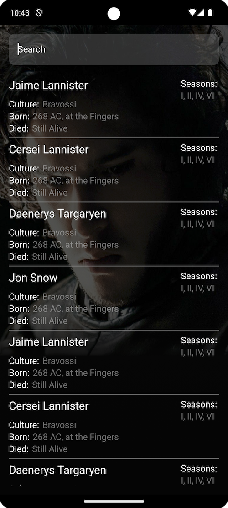
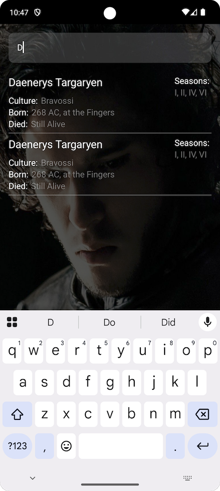

# Description

An Android application that retrieves and displays character information from the Game of Thrones series via an API.

## Technology Stack:

### UI Layer

* Jetpack Compose: For building declarative and reactive UIs.
* Material Design 3: Ensures a modern, visually appealing interface.

### Data Layer

* Retrofit: To fetch data from the remote API.
* Kotlin Coroutines & Flow: For asynchronous programming and reactive data streams.

### Dependency Injection

* Hilt: Simplifies dependency injection for a clean separation of concerns

## Features:

- Home Screen: Home screen that displays a list of Game of Thrones characters retrieved from the API
- Search Option: Search functionality that allows the user to search for a specific character by character’s name.

## 3. Architecture:

###   Clean Architecture Layers:
* Presentation Layer: Jetpack Compose UI interacting with ViewModels.
* Domain Layer: Use Cases handling the business logic.
* Data Layer: Repository pattern for data handling (remote and local).

## Resources

The API endpoint is available from:
[https://yj8ke8qonl.execute-api.eu-west-1.amazonaws.com/characters](https://yj8ke8qonl.execute-api.eu-west-1.amazonaws.com/characters)
Requests to that endpoint will require the following header:
"Authorization": "Bearer 754t!si@glcE2qmOFEcN"

Designs: 

## Further enhancements

- Furthermore cosmetics and refactoring is an endless thought.
- Support tablet UI
- Offline support

